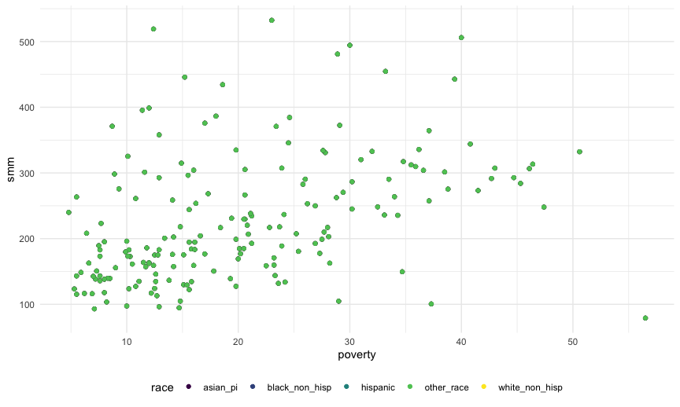

Exploratory Analysis
================
Zaynub Ibrahim (zi2125)
12/2/2020

Clean data:

  - Clean names
  - Select relevant predictors & outcomes
  - Drop neighborhoods that have no population

<!-- end list -->

``` r
plots_df = read_excel("./data/nta-metadata.xlsx", sheet = "NTA Data") %>%
  janitor::clean_names() %>%
  select(nta_name, nta_code, total_pop, hispanic:other_race, poverty, smm) %>%
  drop_na(total_pop) %>% 
  pivot_longer(
   cols = hispanic:other_race,
   names_to = "race",
   values_to = "percent_pop",
   values_drop_na = TRUE
 ) 
```

``` r
race_df = read_excel("./data/nta-metadata.xlsx", sheet = "NTA Data") %>%
  janitor::clean_names() %>%
  select(nta_name, nta_code, total_pop, hispanic:other_race, poverty, smm) %>%
  drop_na(total_pop) %>% 
  pivot_longer(
   cols = hispanic:other_race,
   names_to = "race",
   values_to = "percent_pop",
   values_drop_na = TRUE
 )
```

Plot 1: Poverty Vs SMM, grouped by race

``` r
ggplot(plots_df, aes(x = poverty, y = smm)) + 
  geom_point(aes(color = race))
```

    ## Warning: Removed 25 rows containing missing values (geom_point).


